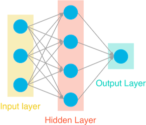
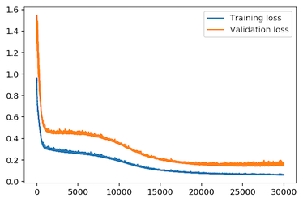
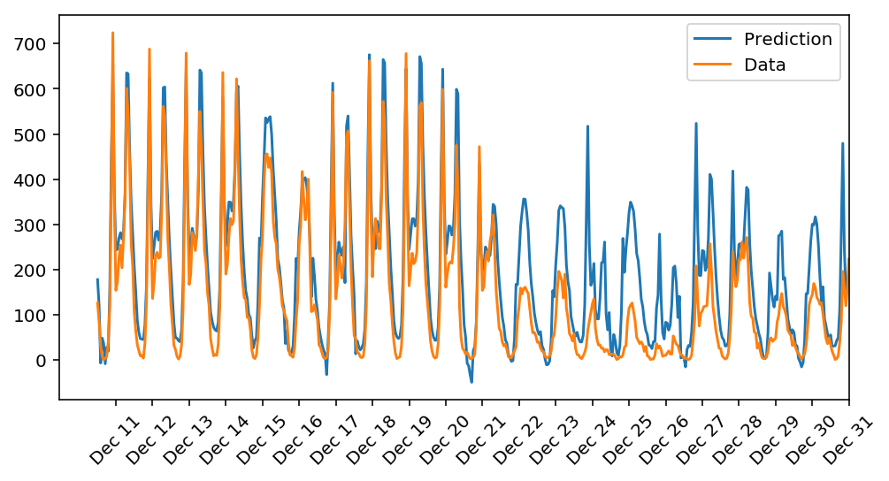

# Predicting Bike Sharing

### Introduction
This project we build and train a Neural Network (NN) to predict the number of bikeshare users on a given day

### Architecture

The NN consists of one input layer, one hiddedn layer and a output layer whose value is the predicted number of bikeshare users. Since this is a regression problem, sigmoid activation function is only used on the hidden layer

### Steps 

Detailed implementation for the NN can be found in [my_answers.py](./my_answers.py). With the hyperparameters `iterations = 30000, learning_rate = 0.1 and hidden_nodes = 40`, we are able to achieve training loss of 6% and validation loss of 15%. 

Figure below plots the prediction on the test data. It can be seen that the model predicts the number of users quite well but becomes off for the days from Dec 21 to 31. Reasones that this is the case can be:
* It's winter time and less people tend to ride bike 
* It's also holidays around Dec21 to 31 and therefore the number os users are not as ususal.

